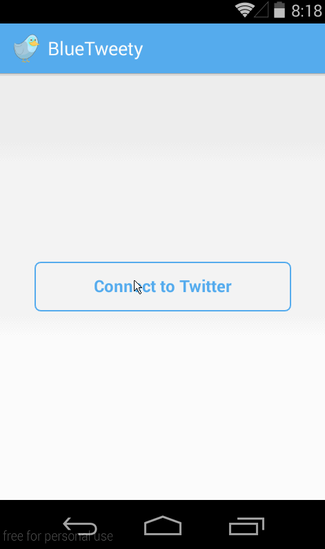

BlueTweety
===========

Simple twitter client for Android.

* User can see the timeline
* User can click on links on tweets
* User can compose a new tweet

* User can sign in to Twitter using OAuth login
* User can view the tweets from their home timeline
    * User is able to see the username, name, body and timestamp for each tweet
    * User is displayed the relative timestamp for a tweet "8m", "7h"
    * User can view more tweets as they scroll with infinite pagination
    * Links in tweets are clickable and will launch the web browser
* User can compose a new tweet
    * User can click the "Compose" icon in the Action Bar on the top right
    * User can then enter a new tweet and post this to twitter
    * User is taken back to home timeline with new tweet visible in timeline
    * User can see a counter with total number of characters left for tweet
* Improved the user interface and theme the app to feel "twitter branded"

Time spent: ~10 hours.

Walkthrough
-----------

